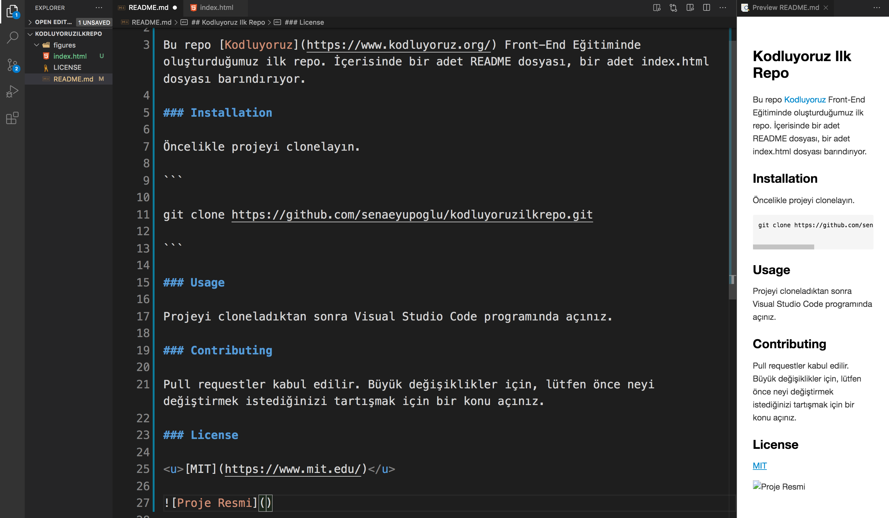

## Kodluyoruz Ilk Repo

Bu repo [Kodluyoruz](https://www.kodluyoruz.org/) Front-End Eğitiminde oluşturduğumuz ilk repo. İçerisinde bir adet README dosyası, bir adet index.html dosyası barındırıyor.

### Installation

Öncelikle projeyi clonelayın.

```

git clone https://github.com/senaeyupoglu/kodluyoruzilkrepo.git

```

### Usage

Projeyi cloneladıktan sonra Visual Studio Code programında açınız.

### Contributing

Pull requestler kabul edilir. Büyük değişiklikler için, lütfen önce neyi değiştirmek istediğinizi tartışmak için bir konu açınız.

### License

<u>[MIT](https://www.mit.edu/)</u>


